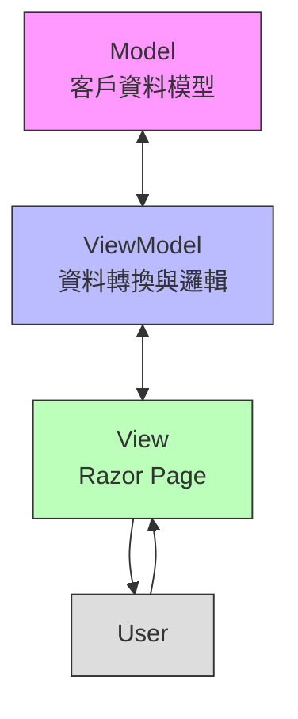
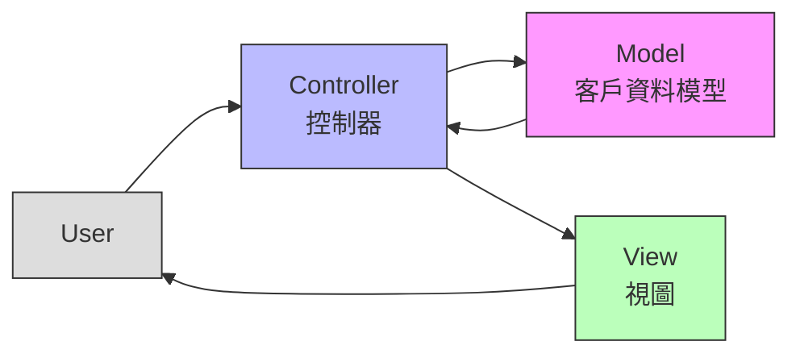

# MVVMvsMVC - ASP.NET Core 架構比較專案

這個專案旨在展示和比較 ASP.NET Core 中 MVVM（Model-View-ViewModel）和 MVC（Model-View-Controller）兩種不同的架構模式。通過實作相同的客戶資料顯示功能，清楚地呈現兩種架構的異同。此專案使用 MainWeb 作為統一入口，讓使用者可以在同一個網站中比較這兩種不同的實現方式。

## 架構流程圖

### MVVM 架構流程


特點說明：
- 雙向資料流：Model <-> ViewModel <-> View
- ViewModel 作為中介者處理資料轉換
- View 和 Model 不直接互動
- 適合資料驅動的介面設計

### MVC 架構流程


特點說明：
- 單向資料流：Controller -> Model -> View
- Controller 負責協調 Model 和 View
- 各組件職責明確分離
- 適合請求驅動的應用程式

## 專案結構

```
MVVMvsMVC/
│
├── Data/                   # 共用資料
│   └── customers.json      # 客戶資料 JSON 檔案
│
├── MainWeb/               # 主網站專案（統一入口）
│   ├── Pages/             # 入口頁面
│   │   ├── Index.cshtml   # 首頁（包含兩種模式的連結）
│   │   └── Shared/        # 共用版面配置
│   ├── Properties/        # 專案配置
│   └── wwwroot/           # 靜態檔案
│
├── MVVM/                  # MVVM 專案 (使用 Razor Pages)
│   ├── Properties/        # 專案配置
│   ├── Models/            # 資料模型
│   ├── ViewModels/        # 視圖模型
│   └── Pages/             # Razor Pages
│
└── MVC/                   # MVC 專案
│   ├── Properties/        # 專案配置
    ├── Models/            # 資料模型
    ├── Views/             # 視圖
    └── Controllers/       # 控制器
```

## 技術棧

- .NET 8.0
- ASP.NET Core
- Razor Pages (MVVM)
- ASP.NET Core MVC
- Bootstrap 5

## 兩種架構的主要差異

### MVVM (使用 Razor Pages)

1. **檔案組織**
   - Pages 資料夾包含 .cshtml 和 .cshtml.cs 檔案
   - ViewModels 資料夾存放視圖模型
   - 頁面和邏輯在同一個資料夾中

2. **資料流向**
   ```
   Model <-> ViewModel <-> View (Razor Page)
   ```

3. **特點**
   - 更適合頁面導向的應用
   - 檔案組織更集中
   - 降低了控制器的複雜性
   - 視圖模型負責資料轉換和業務邏輯

### MVC

1. **檔案組織**
   - Controllers 資料夾存放控制器
   - Views 資料夾存放視圖
   - Models 資料夾存放模型
   - 依功能分散在不同資料夾中

2. **資料流向**
   ```
   Model -> Controller -> View
   ```

3. **特點**
   - 更適合複雜的網路應用
   - 關注點分離更明確
   - 控制器負責處理用戶請求和回應
   - 較容易進行單元測試

## 共同特點

1. **模型（Model）**
   - 兩種架構都使用相同的資料模型
   - 共用 JSON 檔案作為資料來源
   - 模型類別定義基本的資料結構

2. **視圖（View）**
   - 都使用 Razor 語法
   - 使用 Bootstrap 進行樣式設計
   - 都實現相同的表格顯示功能

## 解決方案架構

這個解決方案包含三個專案：

1. **MainWeb**
   - 作為整個應用程式的統一入口點
   - 提供導覽介面，讓使用者可以輕鬆切換between MVVM 和 MVC 實現
   - 使用共用的版面配置和樣式
   - 負責專案的整體配置和路由管理

2. **MVVM**
   - 使用 Razor Pages 實現 MVVM 架構
   - 包含資料模型、視圖模型和頁面
   - 適合頁面導向的應用

3. **MVC**
   - 使用 ASP.NET Core MVC 實現 MVC 架構
   - 包含控制器、視圖和模型
   - 適合複雜的網路應用

## 如何運行專案

### 使用 Visual Studio
1. 開啟 MVVMvsMVC.sln 解決方案檔
2. 將 MainWeb 設為啟動專案
3. 按下 F5 或點擊「啟動」按鈕

### 使用命令列
```bash
# 進入主專案資料夾
cd MainWeb

# 運行整個專案（推薦）
dotnet run

# 或者分別運行子專案
cd ../MVVM
dotnet run

cd ../MVC
dotnet run
```


## 建議的使用場景

### MVVM (Razor Pages)
- 簡單的 CRUD 操作
- 表單密集的應用
- 小型到中型專案
- 需要快速開發的專案

### MVC
- 複雜的業務邏輯
- 需要清晰分層的大型專案
- API 和網頁介面共存的專案
- 需要精細控制的場景

## 學習重點

1. **檔案結構差異**
   - MVVM：Pages 資料夾中的 .cshtml 和 .cshtml.cs 配對
   - MVC：控制器、視圖和模型分開存放

2. **程式碼組織**
   - MVVM：視圖模型處理資料轉換和邏輯
   - MVC：控制器處理請求和回應

3. **資料傳遞方式**
   - MVVM：通過 ViewModel 雙向綁定
   - MVC：控制器單向傳遞給視圖

## 注意事項

- 兩個專案使用相同的資料來源（customers.json）
- 確保 JSON 檔案路徑正確設定
- 專案示範基本的讀取功能，實際應用可能需要更複雜的操作

## 授權

MIT License