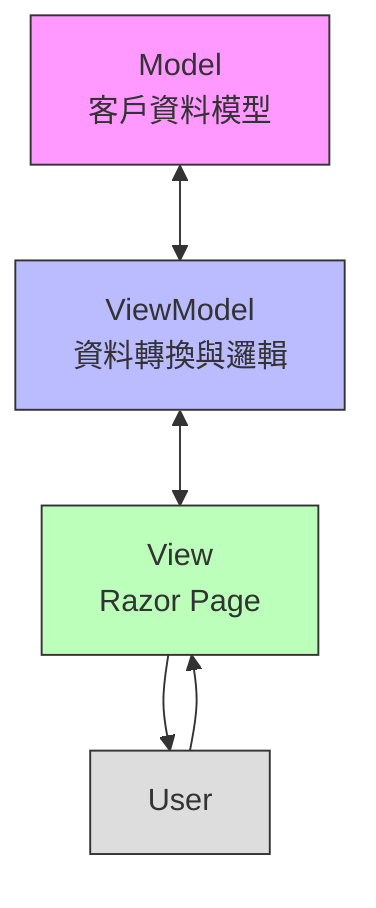
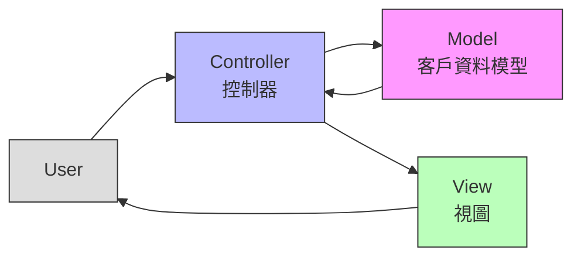
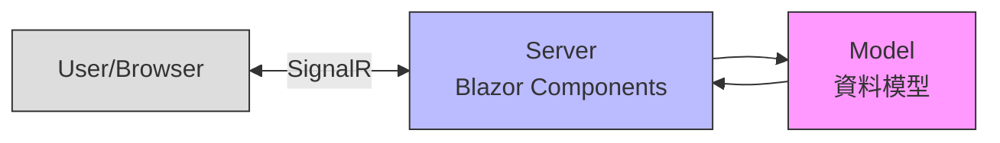
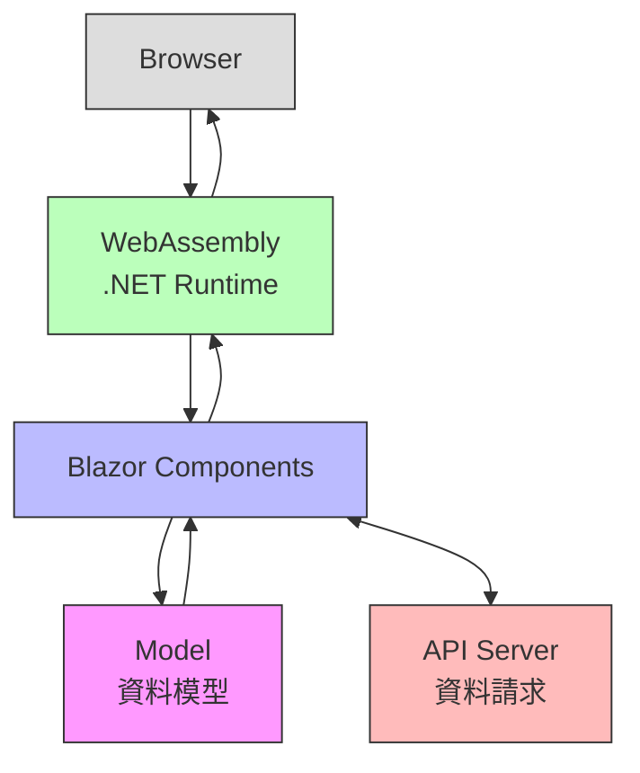

# MVVMvsMVC - ASP.NET Core 架構比較專案

**版本：1.0.0**
**最後更新：2025年4月14日**

這個專案旨在展示和比較 ASP.NET Core 中 MVVM（Model-View-ViewModel）和 MVC（Model-View-Controller）兩種不同的架構模式。通過實作相同的客戶資料顯示功能，清楚地呈現兩種架構的異同。此專案使用 MainWeb 作為統一入口，讓使用者可以在同一個網站中比較這兩種不同的實現方式。

## 目錄

- [架構流程圖](#架構流程圖)
  - [MVVM 架構流程](#mvvm-架構流程)
  - [MVC 架構流程](#mvc-架構流程)
  - [Blazor Server 架構流程](#blazor-server-架構流程)
  - [Blazor WebAssembly 架構流程](#blazor-webassembly-架構流程)
- [專案結構](#專案結構)
- [技術棧](#技術棧)
- [各架構的主要差異](#各架構的主要差異)
  - [MVVM (使用 Razor Pages)](#mvvm-使用-razor-pages)
  - [MVC](#mvc)
  - [Blazor Server](#blazor-server)
  - [Blazor WebAssembly](#blazor-webassembly)
- [架構比較總覽](#架構比較總覽)
- [共同特點](#共同特點)
- [解決方案架構](#解決方案架構)
- [如何運行專案](#如何運行專案)
  - [使用 Visual Studio/Visual Studio Code](#使用-visual-studiovisual-studio-code)
  - [多專案啟動配置](#多專案啟動配置)
  - [使用命令列](#使用命令列)
  - [特別說明](#特別說明)
- [建議的使用場景](#建議的使用場景)
  - [MVVM (Razor Pages)](#mvvm-razor-pages)
  - [MVC](#mvc-1)
  - [Blazor Server](#blazor-server-1)
  - [Blazor WebAssembly](#blazor-webassembly-1)
- [學習重點](#學習重點)
- [注意事項](#注意事項)
- [貢獻指南](#貢獻指南)
- [授權](#授權)
- [延伸閱讀](#延伸閱讀)
- [聯絡方式](#聯絡方式)

## 架構流程圖

### MVVM 架構流程

MVVM 使用 Razor Pages 並透過 ViewModel 作為中介者處理資料邏輯與資料綁定。



特點說明：
- 雙向資料流：Model <-> ViewModel <-> View
- ViewModel 作為中介者處理資料轉換
- View 和 Model 不直接互動
- 適合資料驅動的介面設計

### MVC 架構流程

MVC 採用控制器作為核心，處理用戶請求並協調模型與視圖之間的互動，形成單向資料流。



特點說明：
- 單向資料流：Controller -> Model -> View
- Controller 負責協調 Model 和 View
- 各組件職責明確分離
- 適合請求驅動的應用程式

### Blazor Server 架構流程

Blazor Server 模式讓伺服器處理 UI 邏輯並透過 SignalR 連接即時將 DOM 更新傳送給瀏覽器。



特點說明：
- UI 邏輯和渲染在伺服器端處理
- 透過 SignalR 連接與瀏覽器通訊
- DOM 更新透過 SignalR 訊息傳送
- 適合低延遲網路和需要保護應用程式邏輯的場景
- 伺服器資源消耗較高，但客戶端需求低

### Blazor WebAssembly 架構流程

Blazor WebAssembly 讓 .NET 應用程式直接在瀏覽器中執行，提供與原生應用相似的使用體驗與離線功能。



特點說明：
- UI 邏輯在瀏覽器中的 WebAssembly 環境執行
- 完整的前端 SPA (Single Page Application) 體驗
- 可離線運作，減少伺服器負載
- 初次載入時間較長，但後續互動快速
- 適合需要離線功能或減輕伺服器負擔的應用

## 專案結構

```
MVVMvsMVC/
│
├── Data/                   # 共用資料
│   └── customers.json      # 客戶資料 JSON 檔案
│
├── MainWeb/               # 主網站專案（統一入口）
│   ├── Pages/             # 入口頁面
│   │   ├── Index.cshtml   # 首頁（包含各種模式的連結）
│   │   └── Shared/        # 共用版面配置
│   ├── Properties/        # 專案配置
│   └── wwwroot/           # 靜態檔案
│
├── MVVM/                  # MVVM 專案 (使用 Razor Pages)
│   ├── Properties/        # 專案配置
│   ├── Models/            # 資料模型
│   ├── ViewModels/        # 視圖模型
│   └── Pages/             # Razor Pages
│
├── MVC/                   # MVC 專案
│   ├── Properties/        # 專案配置
│   ├── Models/            # 資料模型
│   ├── Views/             # 視圖
│   └── Controllers/       # 控制器
│
├── Blazor-Server/         # Blazor Server 專案
│   ├── Properties/        # 專案配置
│   ├── Models/            # 資料模型
│   ├── Services/          # 服務層
│   ├── Pages/             # Razor 組件
│   └── Shared/            # 共用組件
│
└── Blazor-WebAssembly/    # Blazor WebAssembly 專案
    ├── Properties/        # 專案配置
    ├── Models/            # 資料模型
    ├── Pages/             # Razor 組件
    ├── Shared/            # 共用組件
    └── Services/          # 服務層
```

## 技術棧

- .NET 8.0（最新 LTS，具備效能與支援優勢）
- ASP.NET Core（Web 應用核心框架）
- Razor Pages（用於 MVVM）
- ASP.NET Core MVC（用於傳統 MVC）
- Blazor Server 和 WebAssembly（用於現代互動式 UI）
- Bootstrap 5（前端樣式，統一風格）

## 各架構的主要差異

### MVVM (使用 Razor Pages)

1. **檔案組織**
   - Pages 資料夾包含 .cshtml 和 .cshtml.cs 檔案
   - ViewModels 資料夾存放視圖模型
   - 頁面和邏輯在同一個資料夾中

2. **資料流向**
   ```
   Model <-> ViewModel <-> View (Razor Page)
   ```

3. **特點**
   - 更適合頁面導向的應用
   - 檔案組織更集中
   - 降低了控制器的複雜性
   - 視圖模型負責資料轉換和業務邏輯

### MVC

1. **檔案組織**
   - Controllers 資料夾存放控制器
   - Views 資料夾存放視圖
   - Models 資料夾存放模型
   - 依功能分散在不同資料夾中

2. **資料流向**
   ```
   Model -> Controller -> View
   ```

3. **特點**
   - 更適合複雜的網路應用
   - 關注點分離更明確
   - 控制器負責處理用戶請求和回應
   - 較容易進行單元測試

### Blazor Server

1. **檔案組織**
   - Pages 資料夾存放 Razor 組件 (.razor 檔案)
   - Services 資料夾負責業務邏輯和數據處理
   - Shared 資料夾包含共用組件

2. **資料流向**
   ```
   Server (Blazor Components + Model) <--> Client (Browser) via SignalR
   ```

3. **特點**
   - 伺服器端處理和渲染 UI
   - 下載量小、啟動快
   - 支援 .NET 的完整功能
   - 需要穩定的連接
   - 伺服器資源消耗較高

### Blazor WebAssembly

1. **檔案組織**
   - Pages 資料夾存放 Razor 組件 (.razor 檔案)
   - Services 資料夾處理 API 呼叫和資料交互
   - Shared 資料夾包含共用組件

2. **資料流向**
   ```
   WebAssembly (Blazor Components + Model) <--> API Server
   ```

3. **特點**
   - 瀏覽器中執行 .NET 程式碼
   - 首次載入較慢，後續互動快速
   - 可離線運作
   - 減輕伺服器負擔
   - 適合 Progressive Web Apps (PWA)

## 架構比較總覽

| 架構類型        | 適合場景                 | 資料流向                      | UI 執行位置     | 初始載入 | 對伺服器依賴 |
|----------------|--------------------------|------------------------------|------------------|-----------|----------------|
| MVVM (Razor)   | 表單密集、快速開發       | Model ↔ ViewModel ↔ View     | 伺服器端         | 快速      | 高             |
| MVC            | 複雜邏輯、大型專案       | Controller → Model → View    | 伺服器端         | 快速      | 高             |
| Blazor Server  | 即時互動、內部系統       | Server UI ↔ Client via SignalR | 伺服器端      | 快速      | 非常高         |
| Blazor WASM    | 公開網站、離線應用       | WebAssembly UI ↔ API Server  | 瀏覽器 (客戶端)  | 較慢      | 低             |

## 共同特點

1. **模型（Model）**
   - 所有架構都可使用相同的資料模型
   - 共用 JSON 檔案作為資料來源
   - 模型類別定義基本的資料結構

2. **視圖呈現**
   - 都使用 Razor 語法（格式有所不同）
   - 使用 Bootstrap 進行樣式設計
   - 都實現相同的表格顯示功能

## 解決方案架構

這個解決方案包含五個專案：

1. **MainWeb**
   - 作為整個應用程式的統一入口點
   - 提供導覽介面，讓使用者可以輕鬆切換各種架構實現
   - 使用共用的版面配置和樣式
   - 負責專案的整體配置和路由管理

2. **MVVM**
   - 使用 Razor Pages 實現 MVVM 架構
   - 包含資料模型、視圖模型和頁面
   - 適合頁面導向的應用

3. **MVC**
   - 使用 ASP.NET Core MVC 實現 MVC 架構
   - 包含控制器、視圖和模型
   - 適合複雜的網路應用

4. **Blazor-Server**
   - 使用 Blazor Server 模式實現
   - 伺服器端處理 UI 邏輯，透過 SignalR 傳送 UI 更新
   - 包含 Razor 組件、服務和模型
   - 適合需要低延遲即時互動的應用

5. **Blazor-WebAssembly**
   - 使用 WebAssembly 在瀏覽器中運行 .NET 程式
   - 前端 SPA 架構，通過 API 呼叫後端服務
   - 包含 Razor 組件、服務和模型
   - 適合需要離線功能的 Web 應用

## 如何運行專案

### 使用 Visual Studio/Visual Studio Code
1. 開啟 MVVMvsMVC.sln 解決方案檔
2. 選擇需要運行的專案：
   - 整合體驗：將 MainWeb 設為啟動專案
   - 個別體驗：分別選擇 MVVM、MVC、Blazor-Server 或 Blazor-WebAssembly 作為啟動專案
3. 按下 F5 或點擊「啟動」按鈕

### 多專案啟動配置
您也可以設定多個專案同時啟動：
1. 在解決方案上按右鍵，選擇「設定啟動專案」
2. 選擇「多個啟動專案」
3. 設定 MainWeb、MVVM、MVC、Blazor-Server 和 Blazor-WebAssembly 為「啟動」

### 使用命令列
```bash
# 運行主入口網站
cd MainWeb
dotnet run

# 或者運行 MVVM 專案
cd ../MVVM
dotnet run

# 或者運行 MVC 專案
cd ../MVC
dotnet run

# 或者運行 Blazor Server 專案
cd ../Blazor-Server
dotnet run

# 或者運行 Blazor WebAssembly 專案
cd ../Blazor-WebAssembly
dotnet run
```

### 特別說明

#### Blazor WebAssembly 專案
Blazor WebAssembly 專案初次載入時間可能較長，因為需要下載 .NET runtime 到瀏覽器中。第一次載入後的操作會更流暢。

#### Blazor Server 專案
Blazor Server 需要保持與伺服器的即時連接，如果連接中斷，頁面交互會暫時停止，直到連接恢復。

## 建議的使用場景

### MVVM (Razor Pages)
- 簡單的 CRUD 操作
- 表單密集的應用
- 小型到中型專案
- 需要快速開發的專案
- 以頁面為中心的網站應用

### MVC
- 複雜的業務邏輯
- 需要清晰分層的大型專案
- API 和網頁介面共存的專案
- 需要精細控制的場景
- 傳統的多頁面 Web 應用

### Blazor Server
- 企業內部應用
- 需要即時通訊的應用
- 網路連接穩定的環境
- 伺服器資源充足的情況
- 需要保護前端程式碼和邏輯的場景
- 低延遲網路環境下的複雜應用

### Blazor WebAssembly
- 公共互聯網應用
- 需要離線功能的應用程式
- Progressive Web Apps (PWA)
- 需要減輕伺服器負擔的應用
- 單頁應用 (SPA)
- 需要原生應用般體驗的 Web 應用

## 學習重點

透過比較不同架構的實現，您可以關注以下關鍵差異：

1.  **檔案與程式碼組織**：觀察不同模式下檔案如何存放，以及邏輯如何劃分（例如 Controller vs ViewModel vs Component）。
2.  **資料流與綁定**：理解資料如何在 Model、View 和 Controller/ViewModel/Component 之間傳遞和同步。
3.  **執行環境與渲染**：區分伺服器端渲染 (SSR) 和客戶端渲染 (CSR) 的不同，以及 Blazor 的特殊模式。
4.  **狀態管理**：了解不同架構下如何處理使用者狀態和應用程式狀態。

## 注意事項

- 各專案使用相同的資料來源（customers.json），請確保檔案路徑正確設定。
- 本專案示範基本的讀取功能，實際應用可能需要更複雜的操作。

## 貢獻指南

如果您對本專案有任何建議或想要貢獻程式碼，歡迎遵循以下步驟：
1. Fork 本專案或建立分支。
2. 進行修改或新增功能。
3. 提交 Pull Request，說明您的變更內容。
4. 等待審核與合併。

如有問題，請開 issue 討論，我們非常樂意聽取您的意見！

## 授權

MIT License

## 延伸閱讀

- [官方 ASP.NET Core 文件](https://learn.microsoft.com/aspnet/core)
- [Blazor 系列教學](https://learn.microsoft.com/aspnet/core/blazor)
- [MVVM vs MVC 架構介紹 - 微軟 Learn](https://learn.microsoft.com/en-us/dotnet/architecture/modern-web-apps-azure/common-web-application-architectures)

## 聯絡方式

如對本專案有任何建議或問題，歡迎開 issue 或聯絡作者 🙌